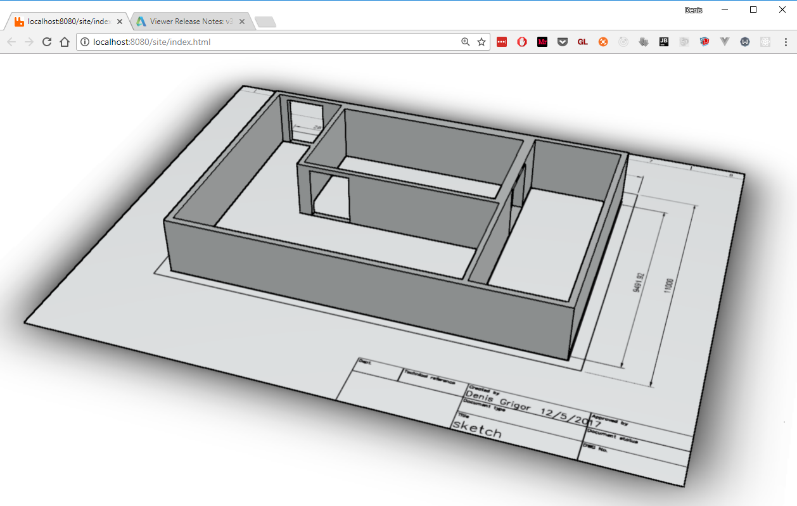

## ZONNER

Sample illustrating the integration of incoming positional data on 3d model.

PoC is about taking position data for contractors on a site and displaying them on a 3D model. When a person moves into a ‘zone’ (a simple cuboid), their ‘training’ is compared to the required training for that zone and the zone color is changed accordingly. The position and ‘training’ data should be available to us via simple REST APIs, so it’s mostly about moving a sprite around the model and changing colors of the zones. 

